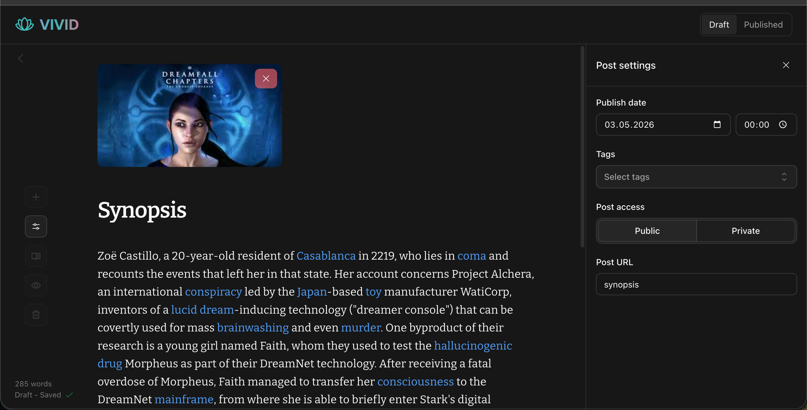
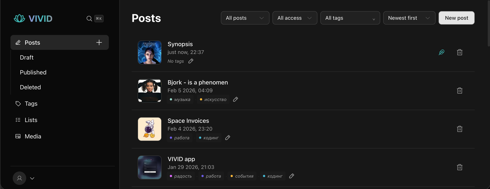
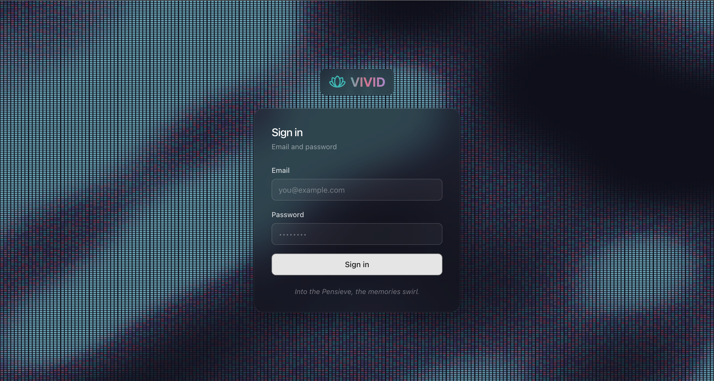

# ✨ Vivid

**Writing-first** personal publishing: a calm admin, Lexical editor, tags, lists, and media — tuned so you spend time on text, not tooling.

The stack is built around **Supabase Postgres** (via Prisma: pooled `DATABASE_URL` + `DIRECT_URL` for migrations) and **S3-compatible object storage** for uploads (Supabase Storage, R2, MinIO, etc.). Auth uses a signed JWT in an httpOnly cookie.


## Screenshots

**Post editor** — Lexical, cover image, word count, draft/published, sidebar settings (date, tags, visibility, slug).



**Posts** — filters, thumbnails, tags, quick edit/delete.



**Sign in** — email/password on the glass-style login screen.



---

## Highlights

- ✍️ **Comfortable writing** — Lexical, drafts, publish flow, command palette, reading mode  
- 🗄️ **Supabase-friendly DB** — PostgreSQL + Prisma  
- 📦 **Files on S3** — presigned uploads; any S3 API–compatible backend  
- 🔐 **Private by default** — blog routes expect a logged-in session  

**Stack:** Next.js 16 · React 19 · Tailwind 4 · Radix · TanStack Query · Task (`Taskfile.yml`)

---

## Quick start

**Needs Node 22** and a Postgres URL (Supabase is a natural fit).

```bash
git clone https://github.com/jehkinen/vivid.git && cd vivid && npm install
# copy .env — DATABASE_URL, DIRECT_URL, AUTH_SECRET, S3_* …
npx prisma generate && npx prisma db push
npm run dev
```

Open [http://localhost:3000](http://localhost:3000) → login.

| Command | What it does |
|---------|----------------|
| `npm run dev` / `build` / `start` | usual Next.js |
| `npm run test` | Vitest |
| `task check` | lint → test → build |
| `task deploy` | push `.env` to Vercel + deploy |

Deploy on **Vercel** with the same env vars; build runs `prisma generate` then `next build`.

---

## Layout

`app/` · `components/` · `hooks/` · `lib/` · `prisma/` · `services/`

---

## License

Licensed under the **[PolyForm Noncommercial License 1.0.0](https://polyformproject.org/licenses/noncommercial/1.0.0)** — see [`LICENSE`](LICENSE).

**In short:** use, modify, and share for **noncommercial** purposes (personal projects, learning, many nonprofits). **Commercial use** — including **selling** the software, hosting it as a paid product, or using it primarily for revenue — is **not** allowed without a separate agreement from the copyright holder. No warranty.

---

<p align="center"><strong>Vivid</strong> · keep writing ✍️</p>
